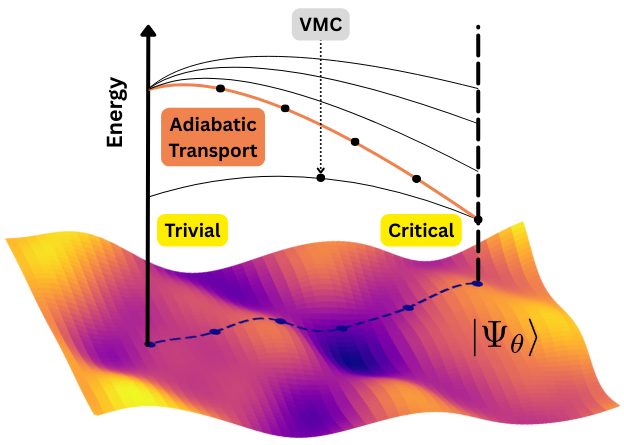

# <h1 align='center'>Adiabatic transport</h1>

Research code for adiabatic transport of neural-network quantum states. This code is attached to the following publication:

**Adiabatic transport of neural network quantum states** ([arXiv:FILL-IN](https://arxiv.org/abs/FILL-IN)).

Code authors: Matija Medvidović and Alev Orfi

<center>
    
</center>

## Installation

Adiabatic transport (ATR) is not available through package managers yet. However, you can install it by pointing `pip` to this repository:

```bash
pip install 'atr@git+https://github.com/Matematija/nqs-adiabatic.git'
```

The `atr` package is built on top of [JAX](https://jax.readthedocs.io/en/latest/) and [Equinox](https://equinox.readthedocs.io/en/latest/), and it leverages their capabilities for automatic differentiation and efficient computation on CPUs and GPUs.

## Adiabatic transport for excited state calculations

The main feature of the `atr` package is adiabatic transport of NQS. Adiabatic transport is performed using a modified version of the *shift-and-invert* or the *inverse power iteration* (IPI) algorithm. This allows us to efficiently compute the ground state energy and wavefunction at each point in the $\lambda$ parameter space. In the hilbert space, the algorithm iterates the following transformation:

$$ \vert \Psi^\prime \rangle \propto (H - \omega )^{-1} \vert \Psi \rangle $$

where $\omega$ is the target energy. This transformation amplifies the component of the wavefunction corresponding to the eigenvalue closest to $\omega$, allowing us to converge to the desired excited state.

For the NQS implementation, we it can be shown that the parameter update $\delta \theta$ reflecting one IPI step is given by $\mathbf{G} \delta \theta = - f$ where
$$\mathbf{G}_{\mu\nu} = 2 \text{Re} \langle \partial_{\mu} \Psi_{\theta} \vert (H_{\lambda} - \omega_{\lambda}) \vert \partial_{\nu} \Psi_{\theta} \rangle $$
$$f_\mu = 2 \text{Re} \langle \partial_{\mu} \Psi_{\theta} \vert H_{\lambda} \vert \Psi_{\theta} \rangle$$

The function `inverse_power_update` calculates precisely this $\delta \theta$ update. New parameters are then given by $\theta \leftarrow \theta + \eta \delta \theta$ with some *dampening* factor $\eta$.

A complete example is available in the `examples/transport.ipynb` notebook. The main steps are as follows:

```python
import jax
import equinox as eqx

from atr.transport import inverse_power_update
from atr.operator import operator_expect_and_variance
from atr.linalg import SoftSpectralSolver
from atr.sampler import SpinSampler

linear_solver = SoftSpectralSolver(rcond=1e-5, acond=1e-7)
sampler = SpinSampler(dims=graph.shape, n_samples=128, n_chains=2)
```

Then, we define a single IPI step as follows:

```python
@eqx.filter_jit
def inverse_power_iter(logpsi, hamiltonian, target_energy, key):

    dampening = 0.1

    samples = sampler(logpsi, key).reshape(-1, *graph.shape)

    E, E_var = operator_expect_and_variance(hamiltonian, logpsi, samples, chunk_size=64)
    d_logpsi = inverse_power_update(logpsi, samples, hamiltonian, target_energy, solver=linear_solver)
    d_logpsi = jax.tree.map(lambda x: dampening * x, d_logpsi)
    logpsi_ = eqx.apply_updates(logpsi, d_logpsi)

    return logpsi_, (E, E_var)
```

Iterating this function at each point in the $\lambda$ grid performs the inverse power iteration, converging to the eigenstate whose energy is closest to the target energy $\omega$, given that the starting wavefunction has sufficient overlap with that eigenstate.

## Neural quantum states

The `atr` package can also be used for simple ground-state NQS calculations. For example, to find the ground state of the transverse-field Ising model on a 1D lattice with periodic boundary conditions:

```python
from time import perf_counter

import jax
import jax.numpy as jnp
import equinox as eqx

import atr
from atr.operator import TransverseFieldIsing
from atr.models import RestrictedBoltzmannMachine
from atr.utils import abs2, natural_gradient
from atr.observables import LocalOperator

graph = atr.graph.Cube((10,), pbc=True) # 1D periodic lattice with 10 sites
H = TransverseFieldIsing(graph, J=0.8, h=1.0)

key = jax.random.PRNGKey(0)
logpsi = RestrictedBoltzmannMachine(n_spins=graph.num_nodes, alpha=2.0, key=key)

sampler = atr.sampler.SpinSampler(dims=graph.shape, n_samples=128, n_chains=2)
```

Then, for, example we can optimize the NQS using natural gradient descent:

```python
optim = optax.sgd(1e-2)
opt_state = optim.init(eqx.filter(logpsi, eqx.is_array))

@eqx.filter_jit
def step(logpsi, opt_state, key):

    samples = sampler(logpsi, key).reshape(-1, N)
    local_energy = LocalOperator(H, logpsi)
    eloc = jax.vmap(local_energy)(samples)
    grads = natural_gradient(logpsi, samples, eloc, diag_shift=1e-6)

    updates, opt_state = optim.update(grads, opt_state)
    logpsi = eqx.apply_updates(logpsi, updates)

    return eloc.real.mean(), logpsi, opt_state

energies = []

for i in range(500): # 500 optimization steps
    key = jax.random.fold_in(key, i)
    energy, logpsi, opt_state = step(logpsi, opt_state, key)
    energies.append(energy.item())
```

A complete example is available in the `examples/ground_state.ipynb` notebook.

## Other features

The `atr` package also contains various utility functions, such as:

- Functions for calculating expectation values and variances of operators with appropriate differentiation rules.
- Interoperability with the `lineax` package for solving linear systems.
- Tools for handling complex parameters in NQS.
- Extensible `Operator` class for defining custom Hamiltonians and observables.
